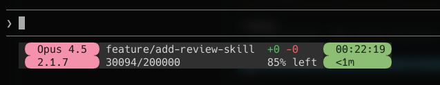

# cc-sakura-line

A minimal statusline for Claude Code — written in Rust, designed to bloom quietly in your terminal.



**Sakura** (桜) are Japanese cherry blossoms: beautiful, fleeting, and understated. This statusline aims for the same feeling — present, but never loud.

## Requirements

- **Rust** 1.70 or later
- **gh** CLI (for GitHub contributions)
- **Nerd Font** (recommended for Powerline glyphs)

## Installation

### Using cargo install (Recommended)

```sh
cargo install --git https://github.com/kokoichi206/cc-sakura-line.git
```

### From Source

1. Clone the repository:

   ```sh
   git clone https://github.com/kokoichi206/cc-sakura-line.git
   cd cc-sakura-line
   ```

2. Build the release binary:

   ```sh
   cargo build --release
   ```

3. Copy the binary to a directory in your PATH (optional):

   ```sh
   # Example: copy to ~/.local/bin
   cp target/release/cc-sakura-line ~/.local/bin/

   # Or create a symlink
   ln -s "$(pwd)/target/release/cc-sakura-line" ~/.local/bin/cc-sakura-line
   ```

### Quick Start

```sh
# Clone and build
git clone https://github.com/kokoichi206/cc-sakura-line.git
cd cc-sakura-line
cargo build --release

# Preview the statusline
./target/release/cc-sakura-line --preview
```

## Claude Code Setup

To use this statusline with Claude Code, add the following to your `~/.claude/settings.json`:

```json
{
  "statusLine": {
    "type": "command",
    "command": "/absolute/path/to/cc-sakura-line",
    "padding": 0
  }
}
```

Replace `/absolute/path/to/cc-sakura-line` with the actual path to the binary. You can find it with:

```sh
which cc-sakura-line
```

After saving the configuration, restart Claude Code to see the new statusline.

## Layout

Three rows, four segments each:

**Row 1 (Claude)**

- Model
- Claude Code version
- Today's GitHub contributions (`🌲 9`)
- Session duration (`<1m`, `32m`, `5h32m`)

**Row 2 (Git)**

- Repository (`owner/repo`)
- Branch
- Git changes (`+n -m`)
- Ahead/Behind (`↑2 ↓0`, `synced`)

**Row 3 (Context)**

- Context used (`45K/200K`)
- Context remaining (`78% left`)
- (empty)
- Local time (`HH:MM:SS`)

## Build

```
cargo build --release
```

## Preview (TUI)

```sh
cargo run -- --preview
```

Press `q` or `Esc` to exit.

## Width behavior

Claude Code can show system notices on the right side. By default, **cc-sakura-line does not fill full width** to avoid collisions.

- Force full width:
  ```
  /path/to/cc-sakura-line --fill
  ```
- Reserve right-side space:
  ```
  /path/to/cc-sakura-line --reserved=24
  ```
- Fix a width (useful when width cannot be detected):
  ```
  /path/to/cc-sakura-line --width=120
  ```

## CLI flags

- `--preview` / `-p`: TUI preview
- `--fill`: fill full width
- `--no-fill`: do not fill full width (default)
- `--width=NUM`: override detected width
- `--reserved=NUM`: keep space for right-side system notices

## Data sources (JSON from Claude Code)

This tool reads from stdin:

- `model.display_name` (or `model.id`)
- `version`
- `context_window.context_window_size`
- `context_window.current_usage.*`
- `cost.total_duration_ms`

Git info is read from the current repository via `git`:

- Repository name (from `git remote get-url origin`)
- Branch name
- Line changes (`git diff --numstat`)
- Ahead/Behind (`git status -b`)

GitHub contributions are fetched via `gh` CLI (GraphQL API):

- Today's contribution count (cached for 5 minutes at `~/.cache/cc-sakura-line/`)

## Optional env overrides

- `CC_MODEL`: model name
- `CC_VERSION`: version label
- `CC_CONTRIBUTIONS`: today's contributions count (overrides GitHub API)
- `CC_GITHUB_USER`: GitHub username (overrides auto-detection)
- `CC_CONTEXT_LABEL`: context text (overrides used/total display)
- `CC_CONTEXT_USED`: used context (number)
- `CC_CONTEXT_TOTAL`: total context (number)
- `CC_CONTEXT_REMAINING`: remaining context text (overrides computed percent)
- `CC_STATUSLINE_WIDTH`: width override (same as `--width`)
- `CC_STATUSLINE_RESERVED`: reserved right-space (same as `--reserved`)
- `CC_STATUSLINE_FILL`: `1` to fill full width (same as `--fill`)

## Fonts

The rounded ends use Powerline glyphs (`` ``). A Nerd Font (or Powerline-compatible font) is recommended.
